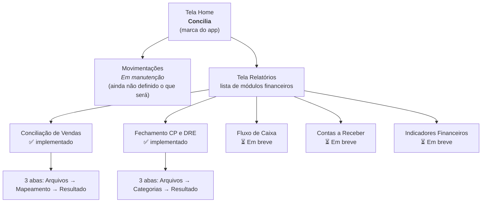

# Concilia (antes Finantron 3000) — Escopo para Design

## O que é

Aplicativo desktop (Windows, `.exe` nativo, instalável) para automatizar processos financeiros de uma rede de padarias/restaurantes com duas unidades: **Mooca** e **Vila Moura**. Hoje cobre conciliação de vendas e fechamento de contas a pagar/DRE; a estrutura já nasceu pensada como um **hub que vai crescer** com outros módulos financeiros ao longo do tempo.

Uso interno, por pessoas não-técnicas da operação (não é um produto vendido a terceiros).

## Identidade visual atual (ponto de partida, não o objetivo final)

- **Nome:** Concilia (renomeado a partir de "Finantron 3000")
- **Ícone atual:** logo "Livro C" (C de linhas de lançamento com visto de conciliado), verde/branco; substituiu o mascote "dinheiro com olhos"
- **Estilo hoje:** telas nativas do Windows (WinForms) — funcional, sem identidade visual trabalhada. Cards brancos com borda simples, cabeçalhos escuros (`#1F1F1F`/`#3D3D3D`), sem paleta de cor própria definida. **Esse é exatamente o ponto onde um trabalho de design entra** — dar uma cara própria ao produto.
- Não há paleta, tipografia ou logo formalmente definidos ainda — só o que foi usado ad-hoc nas telas e nos relatórios Excel.

## Mapa de navegação (3 níveis)

Cada tela aberta a partir de outra tem um botão **"< Voltar"** fixo no topo. Cada módulo, ao terminar, gera um **relatório em Excel** (várias abas) como entregável final — o relatório Excel também é "produto visual" no sentido de que é o que a operação realmente olha no dia a dia.

## Padrão de tela "lista de módulos" (Home e Relatórios)

Cards empilhados verticalmente, cada um com: título do módulo, uma linha de descrição, e um botão "Abrir" (ou "Em breve"/"Em manutenção" quando desabilitado, em cinza). Esse padrão se repete em dois níveis (Home tem 2 cards; Relatórios tem 5) e é pensado para crescer — novos módulos só viram uma nova entrada na lista.

## Padrão de tela "módulo" (Conciliação, Fechamento)

3 abas sequenciais, sempre na mesma ordem:
1. **Arquivos** — usuário sobe as planilhas de entrada (arrastar-e-soltar ou botão), define senha se necessário, campos auxiliares (ex.: modo de cálculo).
2. **Mapeamento/Categorias** — uma tabela de conferência/ajuste antes de gerar o resultado (ex.: qual terminal pertence a qual unidade; qual categoria contábil mapeia pra qual grupo da DRE).
3. **Resultado** — resumo em texto do que foi gerado + botão pra abrir o relatório Excel.

## Módulo 1 — Conciliação de Vendas (implementado)

**Pra que serve:** bate as vendas registradas no sistema da loja contra os extratos dos bancos que processam os cartões/PIX (hoje: C6 e Sicredi), por unidade, por dia, por forma de pagamento (Débito, Crédito, PIX, Voucher e outras formas do sistema como Dinheiro/Conta Assinada).

**O que o usuário faz:** sobe os arquivos do sistema (um por unidade/dia) e os arquivos dos bancos (identificados automaticamente pelo nome do arquivo); confirma o mapeamento de unidade dos terminais; gera o relatório.

**Regra de negócio específica:** a unidade Vila Moura hoje só concilia a forma Voucher — as demais formas dessa unidade são ignoradas de propósito.

**Saída:** relatório Excel com aba "Capa" (resumo executivo por dia, com colunas por unidade, totais e uma coluna de diferença banco vs. sistema) + abas de detalhamento total (rastreabilidade linha a linha de cada venda).

## Módulo 2 — Fechamento CP e DRE (implementado)

**Pra que serve:** fecha as contas a pagar do período e monta a DRE gerencial (Demonstração de Resultado) automaticamente.

**O que o usuário faz:** escolhe o modo (**por Vencimento** ou **por Competência** — muda a data de referência e a fonte de receita esperada), sobe a planilha de despesas e a de receita, confere/ajusta o mapeamento de categoria contábil → categoria macro da DRE, gera o relatório.

**Saída:** relatório Excel com plano de contas detalhado, resumo por categoria, a DRE em formato de cascata (Faturamento → CMV → despesas → EBITDA → Resultado), e uma aba de checks (validações automáticas tipo "bate com o total?", "tem categoria sem mapear?").

**Pendência conhecida:** o formato definitivo da planilha de receita ainda não foi definido pelo usuário; o leitor atual é provisório.

## Módulos planejados (só o nome existe, sem escopo definido)

- **Movimentações** (opção na própria Home, não dentro de Relatórios) — natureza ainda não definida
- **Fluxo de Caixa**
- **Contas a Receber**
- **Indicadores Financeiros**

## Distribuição e atualização (contexto técnico, não visual)

App instalado via instalador próprio (atalho na Área de Trabalho e Menu Iniciar) em cada PC das unidades. A partir da v1.0.0, o app se auto-atualiza: verifica uma versão mais nova ao abrir e pergunta antes de baixar/instalar — não é mais necessário reenviar o instalador manualmente a cada mudança.

## O que faria mais sentido um trabalho de design endereçar

- Uma identidade visual coesa (paleta, tipografia, uso consistente do ícone/mascote) aplicada nas 3 telas de navegação e nos 2 módulos existentes
- Um padrão visual pros relatórios Excel (hoje cada aba tem uma paleta de cor própria, meio ad-hoc)
- Pensar como o padrão de "card de módulo" e "3 abas" escala visualmente conforme mais módulos forem entrando (hoje já são 5 na tela Relatórios, cabendo por scroll)
